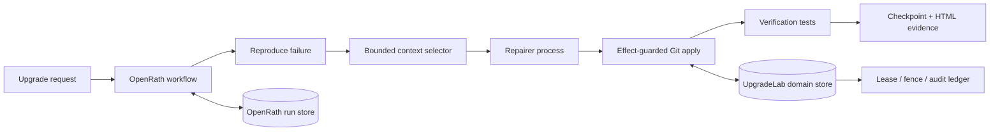

# UpgradeLab

UpgradeLab is a durable backend for AI-assisted dependency upgrade repair. A failed upgrade is
turned into a reproducible workflow: capture the failure, select a bounded code context, request
a patch from a model-agnostic repair agent, apply it exactly once, rerun the contract tests, and
publish evidence that can be audited later.

This is a backend and agent-infrastructure project. Its core value is execution correctness under
retries and worker crashes, rather than a chat interface.

## What is implemented

- transactional SQLite run store with compare-and-swap revisions;
- worker leases, expiry recovery, and fencing tokens that reject stale writes;
- append-only audit events and source/environment-bound checkpoints;
- idempotent effect ledger with explicit reconciliation for uncertain side effects;
- real Git patch application and test execution using argument vectors without a shell;
- traceback and import-graph context selection with file and byte budgets;
- patch-policy enforcement that derives paths from the diff and protects tests and evaluators;
- an independent acceptance command withheld from repairer input and public report output;
- model-agnostic JSON repairer protocol for hosted models, local models, or custom agents;
- OpenRath v2 workflow adapter with four explicit steps and a persisted terminal result;
- standalone HTML evidence reports and a deterministic end-to-end demo.

## Architecture



OpenRath owns durable workflow orchestration. UpgradeLab adds dependency-repair semantics and a
domain sidecar that binds workspace mutations to leases, fencing tokens, request hashes, and
explicit evidence. A retry cannot silently apply a changed request under the same operation key.

## Run the demo

The core has no third-party runtime dependency:

```bash
PYTHONPATH=src python -m upgradelab.cli demo --output-dir .upgradelab/demos
```

The command creates a temporary Git fixture with a failing test, applies a real unified diff,
verifies the repair, persists its event timeline, and writes `report.html`. On PowerShell, use:

```powershell
$env:PYTHONPATH='src'; python -m upgradelab.cli demo --output-dir .upgradelab/demos
```

## Process a real queued repository

Submit a run. Everything after the version is the test command argument vector:

```bash
upgradelab --db .upgradelab/runs.db submit ./repo pydantic 2.10 python -m pytest -q
```

Run one worker with an external repair-agent command:

```bash
upgradelab --db .upgradelab/runs.db worker --owner worker-1 python my_repair_agent.py
```

The repair agent reads one JSON request from stdin and emits one JSON response:

```json
{
  "patch": "diff --git a/pkg/file.py b/pkg/file.py\n...",
  "touched_files": ["pkg/file.py"],
  "rationale": "Adapt the call site to the new dependency contract."
}
```

This process boundary keeps model-provider code out of the execution core and makes requests and
responses easy to record or replay.

## Run the real migration benchmark

The repository includes three pinned Pydantic 2.13.5 migrations: `Field(regex=...)` to
`pattern=...`, `@validator` to `@field_validator`, and `parse_obj` to `model_validate`. Every case
must first reproduce a real failure, then pass a visible contract and a separate acceptance script.
The deterministic repairer is a benchmark baseline, not a model-performance claim.

```powershell
pip install -e ".[benchmark]"
upgradelab benchmark-pydantic --output-dir .upgradelab/benchmarks
```

The recorded 3/3 suite result is in
[benchmarks/results/pydantic-v2-suite.json](./benchmarks/results/pydantic-v2-suite.json), with the
original single-case record retained for comparison.

## Repair boundary

Before `git apply`, UpgradeLab parses the unified diff and requires its actual file paths to match
the candidate declaration. The default policy rejects test, CI, evaluator, binary, symlink,
submodule, oversized, and path-traversal changes. Protected test files may seed import-graph
discovery but their source is removed from the context sent across the repairer process boundary.

## OpenRath integration

Install the optional runtime and construct the workflow through
`build_dependency_repair_workflow`:

```bash
pip install -e ".[openrath]"
```

The adapter uses OpenRath v2 `Workflow`, `@step`, `EffectClass`, `RetryPolicy`, `LocalRuntime`, and
`SQLiteRunStore` interfaces. Read-only reproduction, non-idempotent model inference, idempotent
patch application, and verification are declared separately so the runtime can recover at a step
boundary.

## Verification

```bash
PYTHONPATH=src python -m unittest discover -s tests -v
PYTHONPATH=src python -m compileall -q src tests
```

The suite includes a real OpenRath 2.0 runtime integration test and three Pydantic 2.13.5 migration
cases. It also covers lease takeover, stale-worker fencing, effect replay, uncertain-effect
reconciliation, checkpoint binding, context budgets, the repairer process protocol, the OpenRath
workflow contract, and a real Git/test repair path.

## Trust boundary

`LocalGitWorkspace` is for trusted local repositories. It removes shell parsing, restricts file
operations to the selected worktree, and uses command timeouts, but it is not an operating-system
sandbox. A production deployment should implement the same workspace interface with a disposable
container or microVM and outbound-network policy.

The deeper design and delivery notes are in [UpgradeLab项目设计.md](./UpgradeLab项目设计.md) and
[秋招7天执行计划.md](./秋招7天执行计划.md).

The portfolio page is a self-contained file at [docs/index.html](./docs/index.html). The Pages
workflow publishes it directly from `main` without a frontend build step.

## Attribution

OpenRath provides the workflow runtime primitives. UpgradeLab owns the dependency-repair domain,
workspace/evidence consistency rules, context selection, repairer protocol, and result surface.
