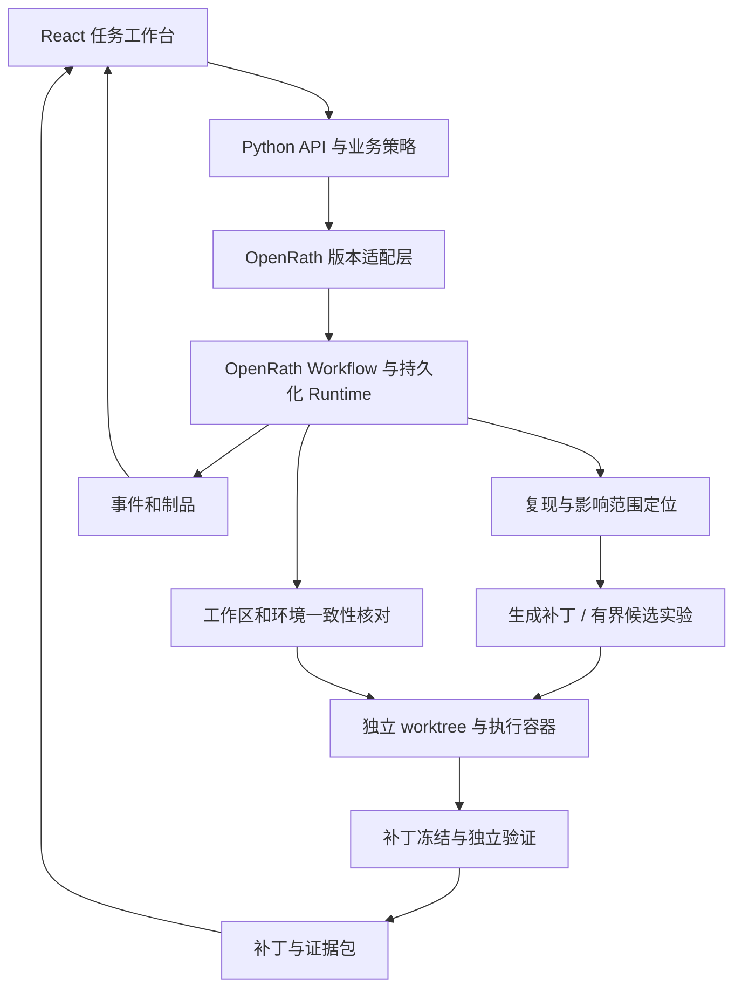

# UpgradeLab：可验证、可恢复的依赖升级修复 Agent

设计日期：2026-09-17，首次实现：2026-09-19。状态：本地最小闭环已实现；容器隔离、公开部署和基准评测尚未完成。

## 1. 定位与范围

面向 Python 项目维护者：依赖升级导致 CI 失败时，复现问题、定位影响范围、生成候选补丁、验证行为兼容性，最终交付补丁与证据包。任务被中断后，校验代码、环境和执行记录，再恢复运行。

第一版聚焦一种依赖迁移和一个 Python 服务仓库。建议使用 Pydantic V1→V2 的固定版本迁移作为首个可复现案例，再根据评测扩展其他依赖。首个案例用于验证机制，不声称这一迁移本身是最新技术。

默认输入：受控仓库、固定 base commit、目标依赖版本、可见测试命令、最大修复轮数和调用预算。输出：patch.diff、测试证据、修复报告、机器可读 manifest、运行轨迹。仓库名 UpgradeLab 为暂定名，未检查名称唯一性。

## 2. 一个能公开演示的任务

1. 展示升级前测试通过。
2. 在指定目标版本环境复现校验、序列化或 API 行为变化导致的失败。
3. 从失败栈和 import 关系定位模型、业务调用与对应测试。
4. 生成一份兼容性修复补丁；困难任务可比较两个独立候选。
5. 执行可见测试和冻结补丁后的独立验收测试。
6. 在应用补丁或执行测试过程中模拟 Worker 退出，恢复后检查状态一致性。
7. 展示补丁、通过和失败的验证项、预算开销以及恢复记录，允许下载结果。

业务行为验收不能只看进程退出码。例如：可选字段的缺省语义、JSON 输出字段、错误响应结构、模型验证结果。

## 3. 上游与个人贡献

OpenRath 文档已有 Session 分支、Workflow、工具接口、检查点、租约、Effect Ledger、人工中断和制品存储。项目复用它作为外层编排运行时。当前实现另有一个 SQLite 领域 sidecar，只记录补丁副作用、工作区证据和 fence token；它不替代 OpenRath 的 Workflow/Session 持久化。

| 上游能力 | 本项目负责的应用机制 |
| --- | --- |
| Agent / Session / Workflow | 依赖升级诊断与修复流程、结构化任务和输出 |
| 检查点与运行恢复 | 代码工作区、依赖环境、测试证据的恢复一致性协议 |
| Effect Ledger | 文件补丁与本地 Git 操作的执行回执、结果核对与冲突处理 |
| Sandbox / Tool | 受控代码工具、测试执行器、候选工作区隔离 |
| Artifact / Events | 修复证据包、候选比较、网页回放和评测数据导出 |

当前适配器固定 OpenRath 2.0 系列，并按官方示例核对了 `Workflow`、`@step`、`EffectClass`、`RetryPolicy`、`LocalRuntime` 与 `SQLiteRunStore` 接口。Agent Server HTTP 接口仍不进入第一版，版本差异收敛在 `src/upgradelab/openrath.py`。

## 4. 核心机制

### A. 基于失败证据的上下文选择

解析 traceback、测试失败节点、Python AST 和 import 边，建立轻量文件关系图。按失败文件、直接调用方、相关测试、迁移参考资料逐步扩展上下文，而不是一次读完整仓库。

输出 ContextManifest：文件范围、选取原因、内容版本和 token 预算。第一版使用可解释的规则排序；动态 import 或复杂调用关系无法静态判断时，记录不确定性并按预算扩大范围。通过消融实验判断它是否优于仅使用失败栈。

### B. 有界候选实验与客观验收

普通任务只生成一个候选；连续失败且预算允许时最多生成两个候选。每个候选绑定独立 Git worktree 和独立运行环境，都从同一 base commit 开始。Session.fork 只负责会话分支，不等于文件系统隔离。

候选先通过目标依赖版本检查、文件修改策略和可见测试。合格候选优先选择业务契约通过、修改范围较小的一份；没有合格候选则明确结束或请求人工处理。不能通过降级依赖、跳过测试、吞异常或修改验收器来“修好”。

最终只选择一份补丁，不直接合并两个候选的代码。多个 Agent 不固定同时参与所有任务；用实验判断额外模型调用是否值得。

### C. 代码与环境的一致性恢复

每份执行记录关联 base commit、补丁摘要、相关工作区内容摘要、依赖锁定信息、执行镜像标识、测试命令和工具操作标识。摘要用于将证据绑定到实际代码和环境，不对仓库进行无目的全量哈希。

重启后：读取上游 Run 与检查点 → 检查工作区及环境 → 核对副作用回执 → 决定复用、重跑、从干净基线重建，或暂停人工判断。旧代码上的通过结果不能用于新补丁。

典型故障：补丁已应用，但持久化确认前 Worker 退出。恢复器须核对实际文件内容，确认操作已经完成或存在冲突；不能直接重新应用补丁，也不宣称任意外部操作都能 exactly-once。

如果 SDK 无法在所需边界注入故障或记录回执，先记录限制并调整适配方式；不能用打印“模拟恢复成功”代替实际进程退出测试。

### D. 独立验收和证据包

Agent 在开发阶段只能访问可见测试。冻结补丁后，独立验证容器运行未提供给 Agent 的验收测试；验收失败反馈不返回本轮 Agent 继续调参。验证容器不挂载模型密钥。

本地发布后测试源码可以公开复现，但正式评测时应由执行器阻止 Agent 读取。将其称为 held-out 验收，不宣称对未来模型训练永久保密。

结果 manifest 记录输入版本、候选补丁、测试及环境身份、成本、状态、失败原因和证据文件。缺少实际执行证据的项目标记 UNKNOWN，不能生成 PASS。

## 5. 架构



首个技术验证可使用 SQLite 单 Worker 运行时。展示版采用 PostgreSQL 持久化和独立 Worker；API 只承担项目业务接口，执行仍由 OpenRath 负责。制品先使用本地卷，必要时接 S3 兼容存储。React + TypeScript 用于工作台，Docker Compose 用于复现。Redis、向量数据库、Kubernetes 和模型训练不列入第一版。

当前 `LocalGitWorkspace` 只用于可信本地仓库：禁用 shell 解析、限制工作树路径并设置超时，但明确不称为沙箱。受控执行容器仍是下一里程碑。

## 6. 产品界面

主界面由四块组成：任务目标与预算、执行阶段与恢复事件、候选 diff 与验证结果、证据文件与下载。

用户输入只包括：选定示例仓库、升级目标、预算。主要操作是运行、停止、恢复、比较候选和下载补丁。运行时看可理解的阶段状态，不向用户堆 SDK 或数据库内部参数。

另提供评测页：按失败类型展示通过率、成本、恢复结果和失败案例；点击某次结果进入只读回放。失败任务和 UNKNOWN 项同样可见。

最有辨识度的演示：运行任务 → 展示候选补丁 → 中断 Worker → 恢复 → 展示状态核对 → 独立验证 → 下载可应用补丁。网页须区分真实在线执行、预录回放和示意数据。

## 7. GitHub 与网页交付

自己的仓库存放领域逻辑、适配器、评测器、示例和前端，以固定版本依赖 OpenRath。只有实际需要改其内部逻辑时才维护 fork，并公开修改范围。

建议目录：

```text
upgradelab/
  README.md
  LICENSE
  THIRD_PARTY_NOTICES.md
  backend/
    workflows/
    context/
    candidates/
    recovery/
    evidence/
    runtime_adapter/
  frontend/
  fixtures/
  benchmarks/
    tasks/
    verifier/
    results/
  tests/
  deploy/
  docs/
```

README 展示问题、60—90 秒演示、个人新增模块、架构、实测结果、复现步骤、失败边界和上游来源。网页提供产品说明、可点击的只读轨迹、补丁 diff、实验报告与 GitHub 链接。GitHub Pages 适合发布静态介绍与回放；实际执行服务单独部署。

公开在线试用限定自有示例仓库和受控环境，设置任务及费用配额；任意仓库接入留给自托管版。任务容器不获得 GitHub 发布凭据；模型调用经宿主侧接口完成。第一版交付补丁与审阅材料，不自动 push 或创建远程 PR。

复制或修改上游代码时保留许可证及版权说明，不暗示独立研发了上游运行时。

## 8. 评测设计

先制作 8—12 个开发任务，跑通不同故障根因。稳定后扩展到约 30 个评测任务，按仓库和错误根因划分开发、验证与验收集，避免同一错误改变量名后落入不同集合。

初始根因包括：验证器 API 变化、序列化行为变化、字段缺省语义、配置变化、跨文件调用兼容性、修复后引入的回归。任务包含修复成功与应停止的案例。

任务可以是自建场景或固定版本的公开历史案例；必须标明来源、授权、难度与构造方法。不能将自建 30 个任务的结果称为通用 SWE-bench 成绩。

| 对照 | 用途 |
| --- | --- |
| 不修复，只升级 | 确认原始错误和评测器有效 |
| 固定版本的确定性迁移规则 | 确认普通自动改写能解决多少任务 |
| 同模型单 Agent + 同样工具和资源上限 | 检验项目策略是否带来提升 |
| 完整方案 | 主实验 |
| 去掉影响范围选择 / 去掉候选比较 | 分别检验两个机制的作用 |

Pydantic 的 bump-pydantic 可作为固定历史版本的迁移规则参考，但仓库页面显示它已于 2026-05-27 归档，不能当作活跃依赖而无条件接入。

所有模型实验记录模型标识、参数、token、工具次数、环境、任务版本和预算上限。同一任务至少重复 3 次，完整记录失败与方差；同样上限下报告实际消耗，必要时给出成功率—成本曲线。

指标：独立验收通过率、目标依赖保持率、回归率、每任务 token / 费用、耗时、候选数、修改文件数。费用以实际供应商计费或明确的计算依据报告，不在设计阶段给出伪造数字。

恢复实验单独进行：在定位后、补丁写入后确认前、测试过程中、测试结束后确认前退出真实 Worker。记录恢复耗时、无效重复调用、状态冲突和最终证据一致性。明确区分合法重跑与重复副作用。

## 9. 开发顺序与完成标准

时间估计以已有 Python 基础、能够持续投入为前提，约 4—6 周；尚未验证 SDK 和部署，不是工期承诺。

| 阶段 | 交付 | 完成标准 |
| --- | --- | --- |
| 0：技术验证，约 2—3 天 | 固定 SDK 版本、一个持久化任务、一个容器工具 | 真实进程退出后恢复；工具确实在容器内执行 |
| 1：最小闭环，约 1 周 | 一种迁移、单候选、patch 与独立验收 | 从失败输入生成补丁；错误补丁和降级作弊能被拒绝 |
| 2：核心二开，约 1—2 周 | 上下文选择、最多两个候选、恢复一致性协议 | 候选隔离；旧证据不可复用；完成关键故障实验 |
| 3：评测，约 1 周 | 任务集、对照和消融、实验报告 | 固定输入和预算；失败可复现；所有指标有原始记录 |
| 4：公开展示，约 1 周 | 工作台、回放页、Compose、演示视频 | 干净环境可启动；网页可查看真实 diff 和证据 |

发布前最低验收：干净环境复现闭环、固定目标版本、真实补丁、独立验收器、至少一个真实 Worker 退出恢复案例、对照实验、明确上游和个人贡献、无虚构评测数据。

若候选比较没有带来足够收益，发布单候选版并在报告解释。若运行恢复接口存在限制，先完成代码修复和评测，公开限定恢复范围，不为了功能清单重写整套运行时。

## 10. 未来简历表述

当前可以写入简历的已完成事实，限于代码和测试能够证明的范围：

- 基于 OpenRath v2 工作流接口开发 Python 依赖升级修复后端，拆分复现、修复、补丁应用和验证阶段，并提供模型无关的 JSON Repairer 协议。
- 实现 SQLite 事务、租约与 fencing token、CAS revision、幂等副作用账本和 UNKNOWN 对账机制，拒绝过期 Worker 写入及同 key 异请求重放。
- 实现 traceback + AST import 图的有界上下文选择、真实 Git patch/test 闭环和 HTML 审计报告；当前测试覆盖正常闭环、租约接管和副作用恢复语义。
- 实现 diff 路径独立解析与保护策略，阻止 Repairer 修改测试、CI 和验收器；独立验收命令不会进入 Repairer 输入或公开报告，并完成 Pydantic 2.13.5 `regex`→`pattern` 单案例基准。

容器隔离、真正不可访问的 hidden tests、多候选对比和成规模评测尚未实现，不能写成已完成结果。当前本地进程边界只能做到“不把验收命令主动传给 Repairer”，不能阻止恶意进程扫描宿主文件系统。

面试准备重点：为什么不是直接使用迁移规则；为什么分支会话不等于隔离工作区；检查点为什么不能独自保证代码状态一致；如何防止模型修改测试以获得假通过；多候选是否值得额外费用。

## 11. 已核对的参考来源

- [OpenRath README：能力边界、扩展接口与 Beta 状态](https://github.com/Rath-Team/OpenRath)
- [OpenRath 官方场景示例：持久化任务与制品模式](https://github.com/Rath-Team/OpenRath-Example)
- [OpenRath 版本记录](https://github.com/Rath-Team/OpenRath/releases)
- [bump-pydantic：历史迁移规则及归档状态](https://github.com/pydantic/bump-pydantic)

本文中的核心本地闭环已经代码级验证；OpenRath 2.0.0 已在隔离虚拟环境中完成注册、提交和 `work_once` 成功终态联调。容器执行、迁移任务集与部署方案仍待后续验证。
